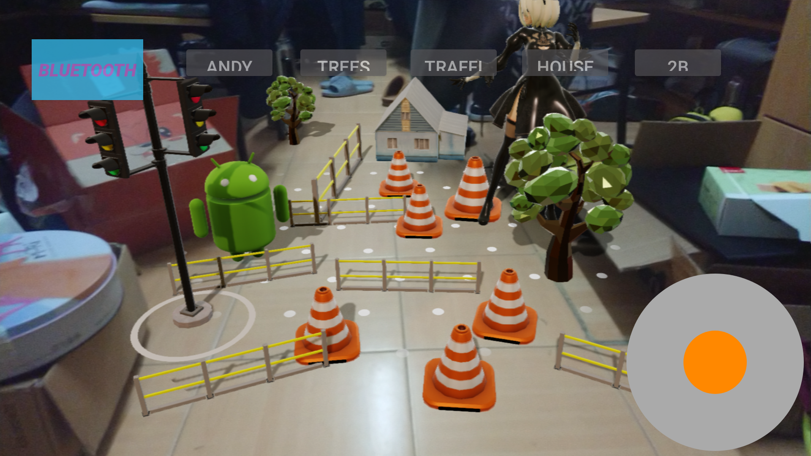
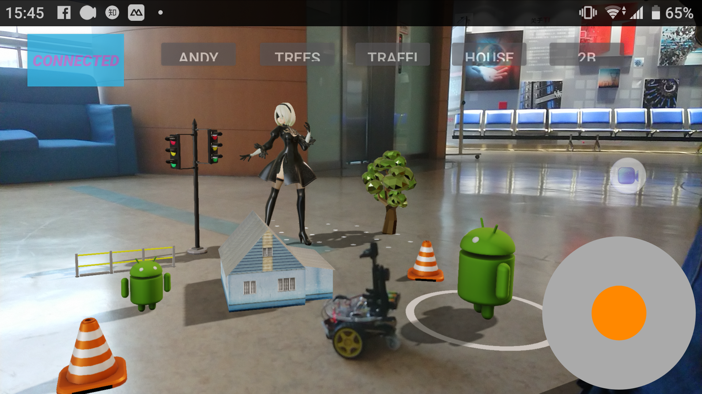

# AR_bluetooth_Car

This is a course project for SJTU kc-3C.

## Description:

本APP利用[Google‘s ARcore](https://developers.google.com/ar/) API，通过Android设备检测并追踪周围环境，之后可以通过任意点击、拖拽、缩放在屏幕中创建虚拟内容。Android设备在呈现虚拟内容的同时，也可以通过Android蓝牙API发信号控制小车。因此蓝牙小车可以在穿行于我们构建的虚拟环境中。这种从虚拟现实软件到蓝牙通信再到电机驱动硬件的交互也是我们的3C项目的创新之处。

## Demo:

You can see it on course [webpage](still on building~)

Note: ARCore doesn't support all Android devices!!! If you want try this app, make sure your device is in [supporting list](https://developers.google.com/ar/discover/supported-devices). (SONY Xperia XZ1® is used for our demo)

#### UI操作：

* 点击右上角蓝色按键可进行蓝牙连接
* 屏幕上方其他灰色按键指示将要生成的模型类型，包括：
  * ANDY：安卓小人
  * Trees： 随机从两种类型的树中选择一种
  * Traffics：交通指示道具，从路障，围栏，红绿灯中随机选择
  * House：房屋
  * 2B：2B小姐姐😋
* 屏幕右下方摇杆可控制蓝牙小车行进

## Codes & References

Our APP is built in [Android Studio](https://developer.android.com/studio/index.html) 3.2 with [ARCore SDK for Android](https://github.com/google-ar/arcore-android-sdk/releases/download/v1.2.1/arcore-android-sdk-v1.2.1.zip). 

Actually our codes are the modifications of an ARCore example. Examples and a quick start can be seen [here](https://developers.google.com/ar/develop/java/quickstart).

The models we used are from https://www.turbosquid.com and https://sketchfab.com both sites provide plentiful 3D models of high quality. 

After downloading needed 3D models, we use [Google Sceneform Tools (Beta)](https://developers.google.com/ar/develop/java/sceneform/import-assets) to convert 3D models to the type compatible with ARCore.

#  

#### *Now have fun with this app and create your own virtual world~*

​    